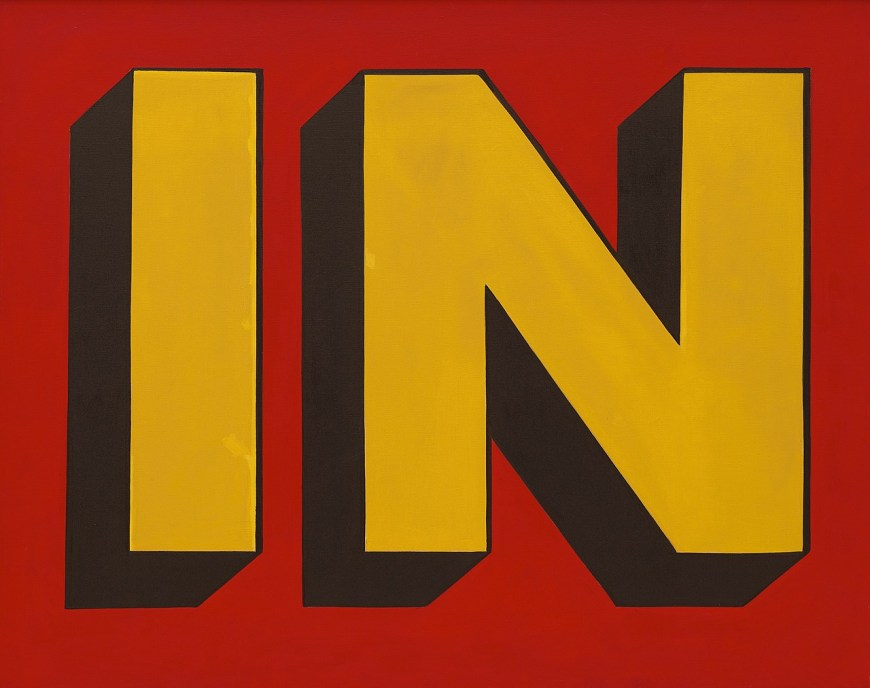

# Assignment 11
## Kathleen
1. What is the difference between padding, margin, and borders?

Borders are the outline that surrounds a certain element, it is usually a solid line. Padding is the area that seperates the content of an element with the outside of the element. Margin is the space between sperate elemnets. 

2. Embed the image of the artwork you used as inspiration. 

3. Free Response: Summarize your work cycle for this assignment. 

First I made my HTMl and my CSS. Then I chose the art work I wanted to use which was "In" by Roy Lictenstien. I really liked the bright colors and the shape of the letters. I then decided to just recreate the I because I felt like that would be easier than recreating the I and N. Then I formatted my HTML that would allow for the three boxes. Then I worked on styling and making sure it was formatted properly to my liking. Then I added the color and the description for the image.
